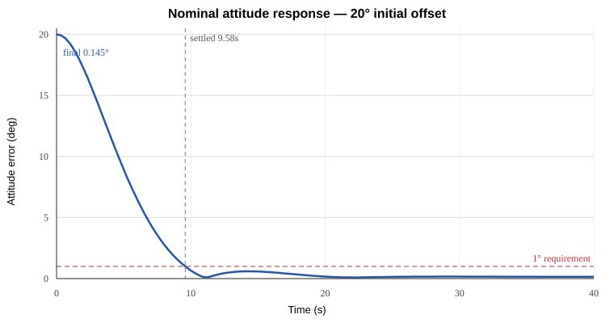

# Spacecraft 6-DOF GNC Simulator

A reproducible educational spacecraft **guidance, navigation and control** simulation built to demonstrate engineering traceability rather than just produce an animation. The code separates truth dynamics, sensors, navigation estimation, guidance, control and reaction-wheel actuation, then verifies the closed loop against explicit requirements and Monte Carlo uncertainty cases.

> This is portfolio/educational software, not flight software and not qualified to ECSS, DO-178C or any other aerospace standard.

## What is implemented

- 13-state 6-DOF rigid-body plant: position, velocity, quaternion attitude and body rate
- Euler rigid-body rotational dynamics and translational point-mass dynamics
- fixed-step RK4 plant integration with quaternion normalization
- gyroscope bias/noise model
- noisy star-tracker absolute-attitude model
- quaternion complementary attitude estimator
- fixed-attitude guidance reference
- quaternion-feedback PD controller
- three-axis reaction-wheel model with torque and stored-momentum saturation
- external force and disturbance-torque injection points
- nominal verification case and reproducible Monte Carlo campaign
- unit/regression tests covering kinematics, dynamics, estimation, actuator limits and closed-loop requirements

## Verified baseline

| Metric | Result |
|---|---:|
| Nominal final attitude error | **0.145 deg** |
| Nominal settling time (<1 deg for 2 s) | **9.58 s** |
| RMS attitude-estimation error | **0.0225 deg** |
| Monte Carlo settling success | **90/90 (100%)** |
| Monte Carlo p95 final error | **0.401 deg** |
| Monte Carlo p95 settling time | **10.64 s** |
| Unit/regression test coverage | **100% (333/333 statements)** |

All six deterministic boundary scenarios also passed, including 45 deg and 60 deg initial-attitude extension cases. Full definitions, assumptions and generated evidence are in [`docs/REQUIREMENTS.md`](docs/REQUIREMENTS.md) and [`docs/PERFORMANCE.md`](docs/PERFORMANCE.md).



## Quick start

```bash
python -m venv .venv
source .venv/bin/activate      # Windows: .venv\Scripts\activate
python -m pip install -e '.[dev]'
pytest
python examples/run_nominal.py
python examples/run_monte_carlo.py --runs 500 --seed 7
```

## Verification targets

The key baseline targets are:

- settle below **1 deg** and stay there for 2 s within **30 s** from a nominal 20 deg attitude error;
- final nominal attitude error below **0.2 deg** at 40 s;
- nominal RMS attitude-estimation error below **0.2 deg**;
- reaction-wheel torque limited to **1.0 N m** per axis;
- reaction-wheel stored momentum limited to **8.0 N m s** per axis.

See [`docs/REQUIREMENTS.md`](docs/REQUIREMENTS.md) for the full traceability table and uncertainty definitions. Generated benchmark values are stored separately in [`docs/PERFORMANCE.md`](docs/PERFORMANCE.md) so claims remain tied to a specific executed campaign.

## Repository layout

```text
src/gnc/
  math_utils.py       Quaternion math and interpolation
  dynamics.py         6-DOF plant and RK4 integration
  sensors.py          Gyroscope and star-tracker models
  estimation.py       Quaternion complementary filter
  guidance.py         Attitude reference interface
  control.py          Quaternion PD controller
  actuators.py        Reaction-wheel torque/momentum limits
  simulation.py       Closed-loop orchestration and metrics
examples/
  run_nominal.py
  run_monte_carlo.py
tests/                Numerical, actuator, estimator and closed-loop tests
docs/
  ARCHITECTURE.md
  REQUIREMENTS.md
  PERFORMANCE.md
artifacts/             Reproducible benchmark summaries
```

## Engineering choices and limitations

The navigation filter is deliberately a quaternion complementary filter rather than an EKF. There is no orbital gravity model, aerodynamic force, flexible-body dynamics, wheel desaturation, thruster allocation or hardware-in-the-loop interface. Sensor uncertainty values in the Monte Carlo campaign are illustrative test conditions, not claimed hardware specifications.

Those limitations are intentional and make the next engineering steps clear: multiplicative EKF, slew/trajectory guidance, orbital environment modelling, reaction-wheel desaturation and software-in-the-loop interfaces.
