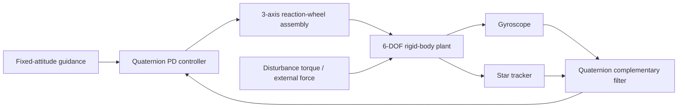

# Architecture

## Truth model

The 13-state plant contains inertial position, inertial velocity, a scalar-first body-to-inertial quaternion, and body angular rate. Translation uses point-mass dynamics and rotation uses Euler's rigid-body equation. The plant is integrated with fixed-step fourth-order Runge–Kutta and renormalizes the quaternion through state reconstruction.

## Navigation

The navigation layer deliberately does **not** consume truth attitude. A gyroscope measurement is propagated every simulation step and a noisy absolute star-tracker measurement is fused periodically through quaternion spherical interpolation. This is a simple complementary estimator, chosen for transparency; it is not represented as an EKF.

## Guidance

The current guidance law provides a fixed target attitude and zero target body rate. The interface is intentionally separated so slew profiles or trajectory-dependent references can be added without modifying the controller.

## Control

The controller forms the shortest-rotation quaternion error and commands proportional attitude torque plus derivative rate damping. Actuator limits are not applied inside the controller; they are handled by the reaction-wheel model so commanded and applied torque remain separately observable.

## Actuation

Three ideal orthogonal reaction wheels enforce per-axis torque and stored-angular-momentum limits. Wheel momentum changes with the negative integral of applied body torque. Momentum management/desaturation is intentionally out of scope and documented as a future extension.
